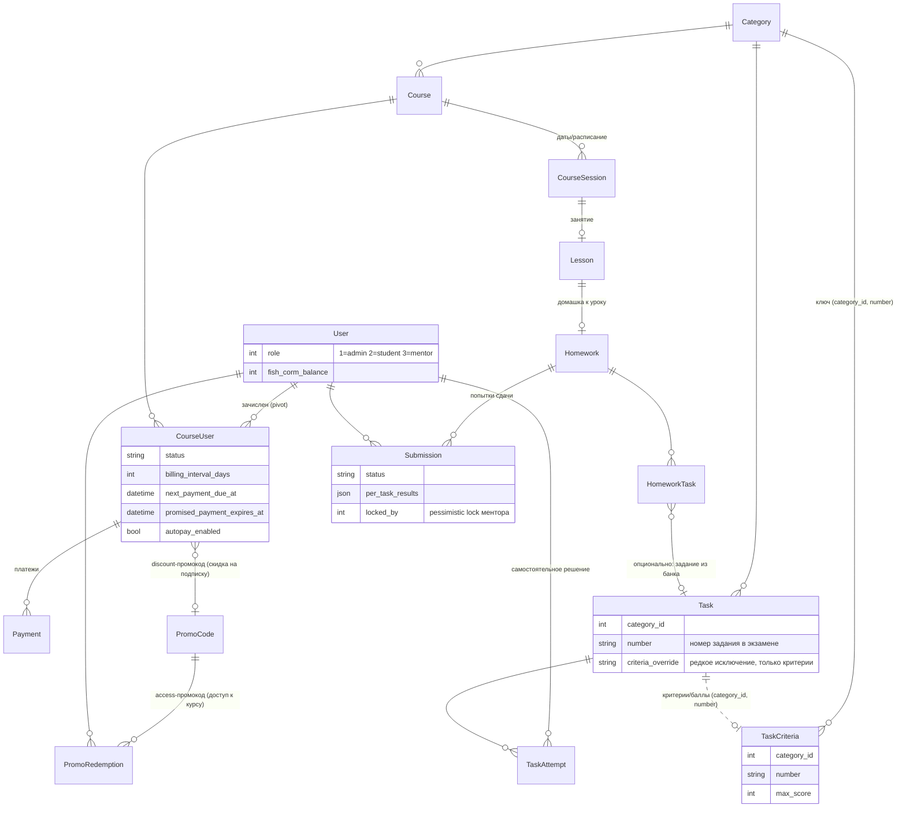

# CLAUDE.md

This file provides guidance to Claude Code (claude.ai/code) when working with code in this repository.

## Что это за проект

Образовательная платформа (подготовка к ЕГЭ/экзаменам): курсы с расписанием сессий/уроков,
банк заданий, домашние работы с автопроверкой + проверкой ментором/ИИ, промокоды и биллинг
по подписке, блог (посты/шпаргалки/упражнения), геймификация (рыба-маскот).

Laravel 10 / PHP 8.1, MySQL, Blade + Tailwind + Vite (без SPA-фреймворка — обычные
контроллеры возвращают Blade-вьюхи, немного vanilla JS). Один монолит `main-app/`.

## Команды

```bash
composer install
npm install
cp .env.example .env && php artisan key:generate

php artisan serve          # backend
npm run dev                # vite dev-сервер (assets)
npm run build               # prod-сборка assets

php artisan migrate
php artisan test                                    # весь набор (PHPUnit)
php artisan test --filter=AutoGraderTest             # один тест/класс
php artisan test tests/Unit/Service/Homework/AutoGraderTest.php
vendor/bin/pint                                     # форматирование (Laravel Pint)
```

Тестов немного и они не покрывают контроллеры/политики — не полагайся на зелёный `test`
как на доказательство корректности авторизации, руками проверяй policy/middleware.

## Архитектура: как всё связано

Роуты (`routes/web.php`) не сгруппированы по одному признаку — там вперемешку живут группы
по namespace (`admin/*` CRUD) и отдельные плоские `Route::` вызовы, добавленные позже поверх.
При добавлении нового роута сначала найди похожий пример рядом, а не полагайся на общую схему
файла целиком.

**Роли** — `User::role` (int): `ROLE_ADMIN=1`, `ROLE_READER=2` (студент), `ROLE_MENTOR=3`.
Проверяются двумя параллельными механизмами, которые не всегда синхронны:
- middleware-алиасы `admin` / `mentor` (`App\Http\Middleware\AdminMiddleware`,
  `MentorMiddleware`) — вешаются на группы роутов;
- Policies (`app/Policies/*`) — `CoursePolicy`, `HomeworkPolicy`, `LessonPolicy`,
  `SubmissionPolicy` — должны вызываться через `$this->authorize()`/`Gate`, но местами это
  забыто (см. раздел "Известные ловушки" ниже) — не считай наличие Policy доказательством,
  что она реально применяется в конкретном контроллере.

**Домены и модели** (`app/Models`):
- `Course` → `CourseSession` (сессии/даты) → `Lesson` (`hasManyThrough` от Course).
  `Course.users()`/`students()` — pivot `course_user` (`CourseUser`), которая несёт
  billing-состояние (см. ниже), а не просто факт зачисления.
- `Homework` (привязана к `lesson_id`, опционально `mock_number` для пробников) →
  `HomeworkTask` (задания внутри конкретной домашки, могут ссылаться на `Task` из банка
  через `task_id`, либо быть заданы inline).
- `Task` — банк заданий, переиспользуется в трёх местах: домашки (`HomeworkTask.task_id`),
  самостоятельное решение в ЛК (`TaskAttempt`, вне `Submission`), публичная SEO-страница
  (`is_public`). Критерии проверки и максимальный балл живут **не на самом Task**, а в
  `TaskCriteria`, ключ — пара `(category_id, number)`: балл/критерии — свойство *номера
  задания в экзамене*, общее для всех вхождений с этим номером, а не конкретной карточки.
  `Task::criteria_override` — редкое точечное исключение только для критериев (не для
  баллов). См. развёрнутый комментарий в начале `app/Models/Task.php`.
- `Submission` — попытка сдачи домашки студентом. `answers`/`per_task_results`/`ai_drafts` —
  JSON-колонки. Есть pessimistic-lock для проверки ментором (`locked_by`/`lock_expires_at`,
  сервис `ReviewLock`) — чтобы два ментора не проверяли одну работу одновременно; логика
  "все ли ручные задания закрыты" разная для ментора (`allManualTasksClosedForMentor`,
  skip засчитывается) и для админа (`allManualTasksClosedForAdmin`, только реальные данные).
- Автопроверка авто-типов заданий — `App\Service\Homework\AutoGrader` (общий для
  `Submission` и самостоятельного прорешивания `Task`). Ручные типы (сочинение и т.п.)
  идут на проверку ментору/ИИ.
- ИИ-проверка (черновик оценки для ментора, не финальное решение) — `OpenAIService::draftScore()`,
  контроллер `Mentor\ReviewAiController`. Есть моковый режим (`config('openai.use_mock')`)
  и локальный эвристический фоллбек при недоступности API — оба нужны, чтобы UI ментора не
  оставался пустым в dev/при сетевых сбоях. Промпт жёстко требует чистый JSON без markdown.
- Биллинг подписки на курс — `App\Service\BillingService` + pivot `course_user`
  (`billing_interval_days`, `next_payment_due_at`, `promised_payment_*`, `autopay_enabled`).
  "Обещанный платёж" (`promise`) — временная отсрочка при просрочке, не настоящий платёж.
  Реального платёжного шлюза нет — `recordPayment()` фиксирует оплату вручную (админом) или
  будущим вебхуком; ничего физически не списывает.
- Промокоды — `PromoCode.kind`: `access` (даёт доступ к курсу) или `discount` (скидка на
  регулярную оплату). Поиск/валидация — `Service/Pricing/PromoLookup`, расчёт цены —
  `Service/Pricing/PromoPricing` (чистая функция, общая для чекаута и биллинга).
  Оба флоу активации (`RedeemController::redeem()`, `BillingService::applyPromoCode()`)
  блокируют строку `promo_codes` через `lockForUpdate()` под `DB::transaction()` перед
  инкрементом `used_count` — см. известную ловушку про MyISAM/InnoDB ниже, без неё это
  ничего не давало. `applyPromoCode()` также не даёт подключить discount-код поверх уже
  подключённого — сначала `removePromoCode()`, иначе `used_count` можно было накручивать
  без per-user лимита в обход UI. Regression-тесты — `tests/Feature/Promo/
  PromoCodeRedemptionTest.php`.
- Геймификация "рыба" — `User.fish_*` поля + `FishFoodService` + `Student\FishController`
  (`POST /student/fish/feed`), настройки уровней в `config/fish.php`. Косметика, намеренно
  не завязана на billing-статус (см. комментарий у роута в `web.php`).

**Auth** — не стандартный Breeze-флоу целиком: вход по телефону (OTP, `PhoneAuthController`,
`Service/Sms/*`) и по email-коду/подписанной ссылке (`EmailAuthController`, `EmailOtpService`),
классическая `/register` отключена (`Auth::routes(['register' => false])`) в пользу
`/auth/email`. `OtpService`/`EmailOtpService` — отдельные сервисы, не путать.

## Схема данных (ER)

Диаграмма охватывает учебное ядро и биллинг — контентный блог (`Post`/`Shpargalka`/`Exercise`/
`Tag`/`PostTag`) не показан, это отдельный, слабо связанный с остальным домен (только
`Category` у них общая с заданиями). Мermaid не умеет показывать составные логические ключи —
связь `Task`/`HomeworkTask` → `TaskCriteria` реально идёт через пару `(category_id, number)`,
а не через FK, это отмечено в аннотации.



Ключевые не-очевидные из диаграммы моменты:
- `HomeworkTask` может существовать без `Task` (inline-задание, содержание в своих колонках)
  или с `task_id` (тогда содержание/баллы проксируются из банка — `HomeworkTask::getAttribute()`
  переопределён именно ради этого).
- Балл и критерии не хранятся ни на `Task`, ни на `HomeworkTask` — источник истины всегда
  `TaskCriteria` по паре `(category_id, number)`.
- `CourseUser` — не просто pivot зачисления, а полноценная billing-запись (см. `BillingService`).
- `PromoCode.kind = 'access'` даёт разовый доступ к курсу и учитывается через `PromoRedemption`;
  `kind = 'discount'` не создаёт `PromoRedemption` — вместо этого просто пишется
  `course_user.promo_code_id` (см. `BillingService::applyPromoCode()`).

## Глоссарий

Термины из продукта/кода, которые не всегда очевидны по названиям классов:

- **Пробник** — тренировочный экзамен с фиксированным таймером 3ч30м
  (`Homework::MOCK_TIME_LIMIT_MINUTES`), `Homework.mock_number` отличает его от обычной домашки.
- **Визард (домашки)** — пошаговый флоу сдачи: один вопрос на страницу
  (`student/submissions/{submission}/questions/{position}`), см.
  `Student\SubmissionController::question/check/save/finish`.
- **Банк заданий** — переиспользуемые задания (`Task`), не привязанные к конкретной домашке;
  редактируются в `admin/tasks`, могут решаться самостоятельно в ЛК студента (`student/tasks`)
  или показываться публично (`is_public`, `/exercises`).
- **Куратор** — роль ментора (`User::ROLE_MENTOR`), проверяет письменные части домашек
  (`mentor/review/*`, `mentor/submissions/*`).
- **Ручные типы заданий** — `HomeworkTask::MANUAL_TYPES` (`written`, `image_written`,
  `image_manual`) — не проверяются автоматически, идут на ревью ментору/ИИ.
- **Черновик ИИ-проверки** — оценка от `OpenAIService::draftScore()`, которую видит ментор
  перед подтверждением; не финальный результат, ментор может изменить.
- **Обещанный платёж (promise)** — временная 5-дневная отсрочка доступа при просрочке оплаты
  курса, не настоящий платёж (`BillingService::grantPromisedPayment()`, `Payment.is_promise`).
- **Автоплатёж (autopay)** — сейчас чисто косметический флаг (переключает уведомления),
  реального списания нет, потому что платёжного шлюза в проекте вообще нет.
- **Корм / рыба-маскот** — игровая валюта геймификации (`fish_corm_balance`), зарабатывается за
  верные ответы/достижения в визарде, тратится на кормление маскота на дашборде
  (`FishFoodService`, `config/fish.php`); подробности стадий — в памяти/roadmap геймификации,
  не в коде.
- **Шпаргалка** — отдельный от курсов тип публичного контента (конспект/памятка),
  модель `Shpargalka`, роут-префикс `/materials`.
- **Промокод access vs discount** — `access` даёт прямой доступ к курсу (создаёт
  `PromoRedemption`), `discount` только снижает цену регулярной оплаты уже зачисленного
  студента (пишется в `course_user.promo_code_id`, без `PromoRedemption`).

## Известные ловушки (см. `SECURITY_AUDIT.md` в корне репозитория для полного списка)

Если трогаешь что-то из этого — не считай текущее поведение образцом для копирования:

- **`Blade::render()` на пользовательском контенте** (`course/show`, `post/show`,
  `shpargalka/show`, `exercise/show`) — поля `content`/`text_spoiler`/`comment` компилируются
  как живой Blade-шаблон, а не просто выводятся с экранированием. Это RCE-вектор, если
  когда-либо скомпрометирован админ-аккаунт или контент попадёт туда не только от админов.
  Не копируй этот паттерн для новых полей контента.
- **(Исправлено, было в `SECURITY_AUDIT.md`) `Student\SubmissionController::create()`
  вызывает `authorize('view', $homework)`** против `HomeworkPolicy` — проверено тестами
  (`tests/Feature/Student/HomeworkSubmissionFlowTest.php`). Метода `store()` в контроллере
  нет вовсе. Если добавляешь новый способ открыть сдачу домашки — просто не забудь такой же
  вызов там, а не полагайся на billing-middleware в одиночку.
- **`Mentor\SubmissionReviewController::resolveTaskMaxScore()` игнорировал реальный
  max_score задания** (было `is_array($tasks) ? $tasks : []` — `$submission->homework->tasks`
  это Eloquent-коллекция, не `array`, проверка всегда была `false`, метод всегда возвращал
  `null`) — из-за этого `saveTask()` не клампил оценку куратора к максимуму задания, и
  `FishFoodService::syncTaskCorm()` в `awardManualTaskCorm()` начислял корм по этой
  нескламленной оценке (итоговый `total_score` при этом клампился отдельно и правильно в
  `recalculateScores()`, так что баг был не виден в UI). Исправлено — заменено на
  `collect($tasks)`, тест `mentor_cannot_award_more_than_the_task_max_score` в том же файле
  ловит регресс.
- Семь моделей объявлены с `$guarded = false` (`Course`, `Category`, `Exercise`, `PostTag`,
  `Section`, `Shpargalka`, `Topic`) — сейчас безопасно, потому что контроллеры используют
  `validated()`, но `Model::create($request->all())` на любой из них будет mass-assignment
  дырой без предупреждения.
- `admin/tasks/*` защищены нормальным middleware `admin` — но соседние `Mentor/
  SubmissionReviewController` и `ReviewAiController` проверяют роль вручную
  (`assertMentorOrAdmin()`) вместо `SubmissionPolicy`/`locked_by`, в отличие от
  `Mentor/SubmissionController`, где lock проверяется правильно.
- `routes/web.php` — не редактируй бездумно порядок в группе `mentor/review`: там
  специфичные пути (`/task/{taskId}/regen`, `/skip`, `/unskip`) намеренно объявлены раньше
  общего `/task/{taskId}` — иначе роутер перехватит их как значение `{taskId}`. Тот же приём
  в `admin/tasks` (`/import`, `/preview`, `/lookup/{task}` до `/{task}`).
- `/dev/ip-https` — незащищённый debug-роут без auth, отключает проверку TLS-сертификата.
  Похоже на забытый dev-код, а не на нужную функциональность.
- **Почти вся БД — MyISAM, не InnoDB** (проверяй через
  `information_schema.TABLES`, если сомневаешься). MyISAM не поддерживает ни
  транзакции (`DB::transaction()` не откатывает ничего при исключении), ни
  row-level locking (`lockForUpdate()` — no-op, ничего не блокирует). Именно
  из-за этого "исправленная" гонка за `max_uses` в промокодах изначально не
  была исправлена по-настоящему — код выглядел защищённым, но защита ничего
  не блокировала на уровне БД. `promo_codes`/`promo_redemptions`/
  `course_user` переведены на InnoDB (`2026_08_03_190000_convert_promo_
  tables_to_innodb.php`) — только они. Остальные таблицы (`users`, `courses`,
  `payments` и т.д.) всё ещё MyISAM: любой `DB::transaction()`/
  `lockForUpdate()` на них (например, `BillingService::recordPayment()`) даёт
  ту же ложную защиту. Если пишешь новый код, полагающийся на атомарность
  транзакции или на блокировку строки — сначала проверь engine таблицы, не
  полагайся на то, что `DB::transaction()` в принципе что-то откатывает.

## Соглашения в коде

- Контроллеры admin-CRUD разбиты по одному классу на действие (`IndexController`,
  `CreateController`, `StoreController`, `ShowController`, `EditController`,
  `UpdateController`, `DestroyController`/`DeleteController`) в подпапке по сущности —
  не single-resource-controller. Следуй этому паттерну для новых admin-сущностей.
- Комментарии в коде объясняют *почему* (история бага, неочевидный инвариант), а не *что* —
  читай их перед правкой соседнего кода, там часто зафиксирована причина, по которой что-то
  сделано не самым очевидным способом.
- Плановые задачи — `App\Console\Kernel::schedule()` (просрочка зачислений, биллинг-
  напоминания, уведомления об уроках/домашках). Новые периодические джобы регистрируются там же.
